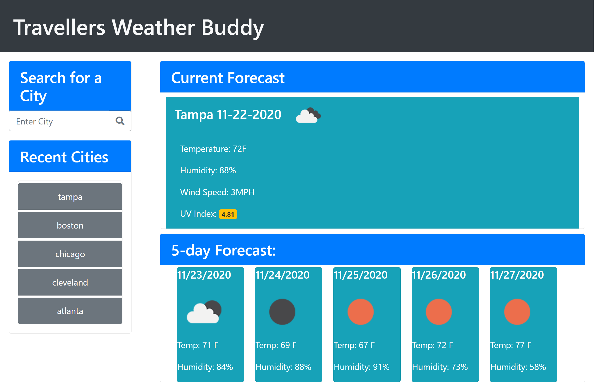

# travellers-weather-buddy

# Purpose

This is a Website that will give the user the current weather and a 5 day forecast. It allows the user to better plan out
their events based on the weather conditions.

# Contents

<ul>
    <li><a href="#features">Features</a></li>
    <li><a href="#website">Website</a></li>
    <li><a href="#contributions">Contributions</a></li>
</ul>

# Features

<ul id="features">
    <li>Built with HTML, Bootstrap, and JavaScript(DOM and API manipulation).</li>
    <li>Gives current and future weather forecast.</li>
    <li>Displays an icon for weather(cloudy, sunny, rain, and etc)</li>
    <li>Uv index is color coded to let user know if it's low, moderate, or severe</li>
</ul>

# Website

<a href="https://dmorrel7.github.io/travellers-weather-buddy/">Travellers Weather Buddy</a>

# Contributions

<ul id="contributions">
    <li>MomentJs</li>
    <li>StackOverFlow</li>
    <li>Bootstrap</li>
    <li>Michael Lochman, a friend and fellow programmer</li>
    <li>WeatherMap Api</li>
</ul>

